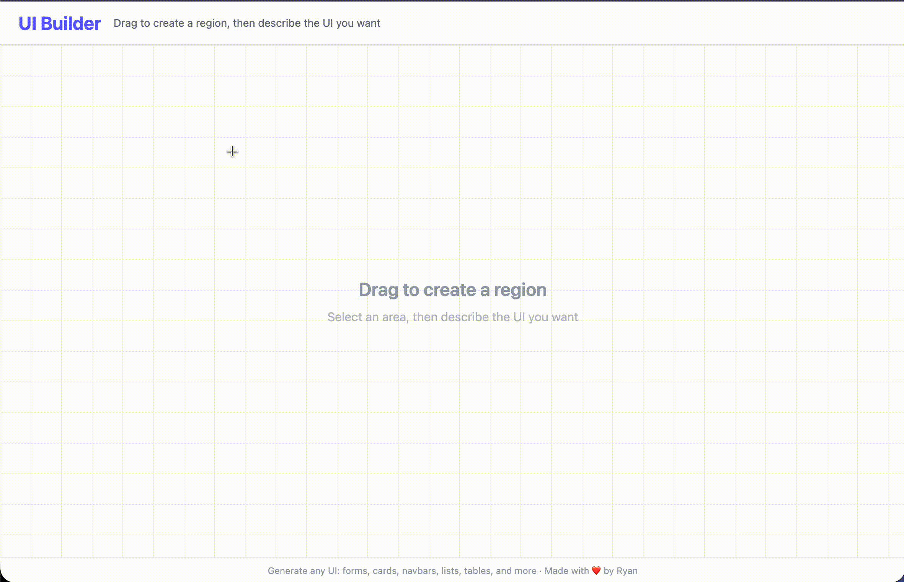

# ipman

A quick UI builder, drag to create a region, describe what you want in plain English, and watch it generate components where you want them. Drag, resize to your liking.

## Built with
React, TypeScript, Tailwind, OpenAI, and Vite

<p align="center">
  
</p>


## Includes

- 🎨 **Talk to it** — "make me a card with an image and title" actually works
- 📐 **Drag stuff around** — move and resize things however you want
- ✨ **Change your mind** — hit refine and say "actually make it blue"
- 💻 **Peek at the code** — see what it generated
- ✏️ **Edit it yourself** — for customization

## Run it 

```bash
# grab the deps
npm install

# add your openai key to .env
VITE_OPENAI_API_KEY=your-key-here

# fire it up
npm run dev
```

Then hit up [localhost:5173](http://localhost:5173) and go wild.

## Tips

- The more specific you are, the better it gets ("rounded blue button with shadow" > "button")
- Don't like what you got? Use ✨ to tweak it
- Hit </> to see the JSX if you're curious


---

Made with ❤️ by [Ryan](https://github.com/xde013)
